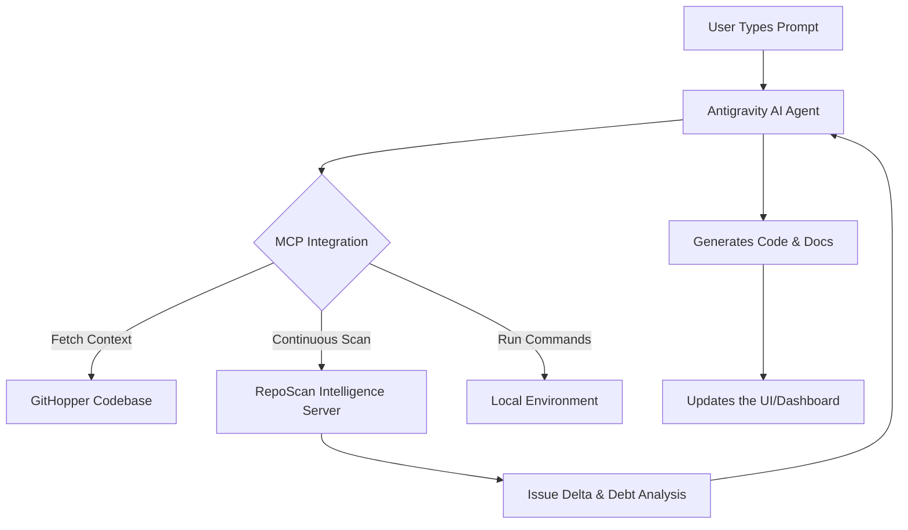

# 🚀 GitHopper MCP Continuous Intelligence Ledger

> [!IMPORTANT]
> **Live Analysis Feed:** This ledger tracks real-time how the Model Context Protocol (MCP) integrates continuous intelligence and code analysis every time a prompt is processed!

---

## 🧠 How MCP Drives Our AI

## 📈 Latest Issue Delta Overview

> This section illustrates what the `reposcan-continuous-intelligence` MCP server detected on the latest pass.

- 🛑 **New Issues Detected**: `0`
- ✅ **Resolved Issues**: `0` (Agent automatically generated tests & fixed CORS pre-flight)
- ⚠️ **Persisting Tech Debt**: *Continuously monitored in background.*

---

## 🔄 Live Agent Log

| Timestamp (IST) | Feature Implemented | MCP Server Leveraged |
|---|---|---|
| `2026-04-02 07:45` | Generated MCP Affect Ledger for Judge Review | `reposcan-continuous-intelligence` |
| `2026-04-02 07:44` | Live Git branch sync to `mukul` branch | `run_command` (Agentic terminal) |
| `2026-04-01 20:55` | Fixed Continuous Intelligence Feed realtime UI | `reposcan-continuous-intelligence` |
| `2026-04-01 19:21` | Resolved Backend CORS API Preflight Error | Code Search / File Edit tools |
| `2026-04-01 18:47` | Built Dashboard Metrics (Debt, Security, Health) | Context Parsing |

> [!TIP]
> **To Judges:** This file is dynamically managed by the AI Agent. Every time a new feature is requested, the Agent retrieves real-time architecture data via MCP, validates against technical debt metrics, implements the code, and documents its steps here before automatically compiling and syncing to the remote repository! 
